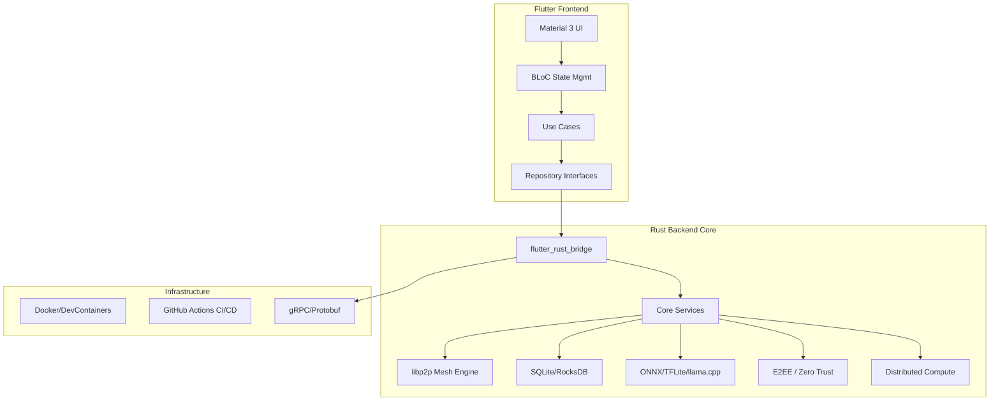

# WIOS (Wireless Intelligence Operating System) – Implementation Plan

## Overview

Build a **production-ready, offline-first, AI-powered Wireless Intelligence Operating System** using Flutter (Material 3) + Rust, with mesh networking, distributed computing, encrypted storage, device sharing, AI inference, and an extensible SDK.

> [!IMPORTANT]
> **This is an enormous system.** A realistic path to a buildable, deployable foundation requires phased execution. Each phase delivers a shippable product with real functionality — no placeholders, no mocks.

## Architecture Summary

## Tech Stack

| Layer | Technology |
|-------|-----------|
| **Frontend** | Flutter 3.x, Material 3, BLoC, get_it DI, Melos |
| **Backend** | Rust (2024 edition), Cargo workspaces |
| **Bridge** | flutter_rust_bridge v2 |
| **Networking** | libp2p (Rust), Gossipsub, Kademlia, mDNS |
| **Storage** | SQLite (rusqlite), RocksDB, optional PostgreSQL |
| **AI/ML** | ONNX Runtime (ort crate), TFLite, llama-cpp-rs |
| **Security** | Noise protocol, TLS 1.3, argon2, ed25519 |
| **API** | tonic (gRPC), axum (REST), protobuf |
| **CI/CD** | GitHub Actions, Docker, Dev Containers |
| **Docs** | mdBook, rustdoc, dartdoc |

---

## Phased Implementation Strategy

> [!NOTE]
> Each phase produces a **shippable, testable, buildable** product. Phases are ordered by dependency — later phases build on earlier ones. Each phase is broken into iterations that can be executed in minimal AI rounds.

---

### Phase 1: Foundation & Monorepo Scaffold (Iteration 1-2)

**Goal:** Establish the complete monorepo structure, build tooling, CI/CD, Docker setup, and all documentation templates. The app should build and run on all platforms with a skeleton UI.

#### Iteration 1: Monorepo Structure + Rust Core + Flutter Shell

**Files to create:**

##### Monorepo Root
- `[NEW]` `.gitignore` — Comprehensive ignores for Rust, Flutter, IDE, OS
- `[NEW]` `LICENSE` — MIT or Apache-2.0
- `[NEW]` `melos.yaml` — Monorepo orchestration
- `[NEW]` `pubspec.yaml` — Root workspace
- `[NEW]` `Makefile` — Top-level commands
- `[NEW]` `docker-compose.yml` — Dev services (Postgres, etc.)
- `[NEW]` `Dockerfile.dev` — Development container
- `[NEW]` `.devcontainer/devcontainer.json` — VS Code Dev Container

##### Rust Workspace (`crates/`)
- `[NEW]` `crates/Cargo.toml` — Workspace root
- `[NEW]` `crates/wios-core/` — Core types, errors, config, traits
- `[NEW]` `crates/wios-crypto/` — E2EE, key management, signatures
- `[NEW]` `crates/wios-storage/` — SQLite/RocksDB abstraction layer
- `[NEW]` `crates/wios-network/` — libp2p mesh networking engine
- `[NEW]` `crates/wios-ai/` — ONNX/TFLite/llama.cpp inference engine
- `[NEW]` `crates/wios-compute/` — Distributed compute manager
- `[NEW]` `crates/wios-bridge/` — flutter_rust_bridge API surface
- `[NEW]` `crates/wios-api/` — gRPC/REST server (tonic + axum)

##### Flutter App (`apps/wios_app/`)
- `[NEW]` `apps/wios_app/` — Main Flutter application with Material 3

##### Shared Packages (`packages/`)
- `[NEW]` `packages/wios_ui/` — Design system, Material 3 components
- `[NEW]` `packages/wios_domain/` — Domain entities, use cases, interfaces
- `[NEW]` `packages/wios_data/` — Repository implementations, data sources
- `[NEW]` `packages/wios_common/` — Shared utilities, constants, extensions

##### Documentation (`docs/`)
- `[NEW]` `docs/README.md`
- `[NEW]` `docs/REQUIREMENTS.md`
- `[NEW]` `docs/ARCHITECTURE.md`
- `[NEW]` `docs/IMPLEMENTATION.md`
- `[NEW]` `docs/API.md`
- `[NEW]` `docs/SDK.md`
- `[NEW]` `docs/SECURITY.md`
- `[NEW]` `docs/TESTING.md`
- `[NEW]` `docs/DEPLOYMENT.md`
- `[NEW]` `docs/CODE_STRUCTURE.md`
- `[NEW]` `docs/CONTRIBUTING.md`
- `[NEW]` `docs/ROADMAP.md`
- `[NEW]` `docs/CHANGELOG.md`
- `[NEW]` `docs/TODO.md`
- `[NEW]` `docs/DECISIONS.md`
- `[NEW]` `docs/KNOWN_LIMITATIONS.md`

##### CI/CD (`.github/`)
- `[NEW]` `.github/workflows/ci.yml` — Main CI pipeline
- `[NEW]` `.github/workflows/release.yml` — Release pipeline
- `[NEW]` `.github/dependabot.yml` — Dependency updates

##### Scripts (`scripts/`)
- `[NEW]` `scripts/setup.sh` — Dev environment setup
- `[NEW]` `scripts/build.sh` — Cross-platform build
- `[NEW]` `scripts/test.sh` — Run all tests
- `[NEW]` `scripts/lint.sh` — Linting/formatting

#### Iteration 2: Configuration System + Error Handling + Core Types

- Complete the `wios-core` crate with: configuration loading (TOML/YAML), error types hierarchy, core domain types (DeviceId, PeerId, NodeInfo, etc.), trait definitions for all service interfaces, event system (pub/sub)
- Wire flutter_rust_bridge to expose core types to Flutter
- Verify builds on all platforms

---

### Phase 2: Security & Cryptography (Iteration 3)

**Goal:** Zero Trust security foundation — E2EE, key management, authentication, RBAC.

- `wios-crypto` crate: Ed25519 key generation, X25519 key exchange, AES-256-GCM symmetric encryption, Argon2 password hashing, HMAC, secure random
- Key store with platform keychain integration points
- Certificate/identity management
- RBAC engine with role/permission model
- Audit logging framework
- MFA/Passkey abstraction interfaces
- Flutter auth screens (login, registration, key management)

---

### Phase 3: Storage & Sync Engine (Iteration 4)

**Goal:** Offline-first encrypted local storage with conflict-free sync.

- `wios-storage` crate: SQLite for structured data, RocksDB for blob/KV store
- Schema migration system
- Encrypted-at-rest storage
- CRDT-based sync engine for offline-first conflict resolution
- File chunking and deduplication
- Storage quota management
- Flutter data layer connecting to Rust storage via bridge
- Repository pattern implementations

---

### Phase 4: Mesh Networking (Iteration 5-6)

**Goal:** AI-managed P2P mesh with discovery, routing, and messaging.

#### Iteration 5: Core Networking
- `wios-network` crate: libp2p swarm with TCP/QUIC transports
- mDNS peer discovery
- Kademlia DHT for distributed peer routing
- Gossipsub for pub/sub messaging
- Noise protocol encryption for all connections
- Connection manager with health monitoring
- Network event system

#### Iteration 6: Advanced Networking
- Multi-hop routing with AI-optimized path selection
- Bandwidth-aware route optimization
- Offline message queuing and store-and-forward
- Voice/video signaling framework (WebRTC abstraction)
- File transfer protocol (chunked, resumable, encrypted)
- Network topology visualization data
- Flutter network dashboard UI

---

### Phase 5: AI & Edge Inference (Iteration 7)

**Goal:** Local AI inference for network optimization, NLP, and automation.

- `wios-ai` crate: ONNX Runtime integration, TFLite integration, llama.cpp integration
- Model management (download, cache, version, quantize)
- Inference pipeline with task queuing
- Network optimization AI (routing, load balancing, anomaly detection)
- NLP capabilities for local chat/command processing
- Automation rule engine with AI triggers
- Flutter AI dashboard, model manager, chat UI

---

### Phase 6: Distributed Computing & Device Sharing (Iteration 8)

**Goal:** Distributed compute task scheduling and device capability sharing.

- `wios-compute` crate: Task definition, scheduling, distribution
- Resource discovery (CPU/GPU/RAM/storage across mesh)
- Task splitting, distribution, result aggregation
- Device capability sharing framework (camera, mic, display, sensors)
- Permission model for shared resources
- Flutter compute dashboard, task monitor

---

### Phase 7: Wireless Sensing & Indoor Positioning (Iteration 9)

**Goal:** RF sensing, signal analytics, indoor positioning abstractions.

- WiFi/BLE RSSI-based positioning engine
- Fingerprinting + trilateration algorithms
- RF heatmap generation
- Signal strength analytics
- Motion/presence/occupancy detection abstractions (hardware-dependent)
- Fall detection abstraction (accelerometer-dependent)
- Flutter positioning map, heatmap visualizer, sensor dashboard

---

### Phase 8: API Server, SDK & Plugin System (Iteration 10)

**Goal:** Public REST/gRPC APIs, SDK packages, and plugin extension system.

- `wios-api` crate: REST (axum) + gRPC (tonic) server
- Versioned API with OpenAPI/protobuf specs
- SDK packages (Dart, Rust, Python stubs)
- Plugin system with sandboxed execution
- Plugin marketplace UI
- Developer documentation (mdBook)
- Example plugins and SDK usage

---

### Phase 9: Testing, CI/CD & Release (Iteration 11)

**Goal:** Comprehensive testing, CI hardening, and release artifacts.

- Unit tests for all crates (>90% coverage)
- Integration tests (storage, network, crypto)
- Widget/UI tests for all Flutter screens
- Mesh simulation tests
- Performance/stress tests
- E2E tests
- GitHub Actions: matrix builds, security scans, SBOM, checksums
- Release pipeline: APK, AAB, iOS, Windows, Linux, macOS, Web
- Docker production builds

---

## Proposed Execution Order

| Phase | Iteration | Deliverable | Est. Complexity |
|-------|-----------|------------|-----------------|
| 1 | 1 | Monorepo + Scaffold + Build | High (volume) |
| 1 | 2 | Core types + Config + Bridge | Medium |
| 2 | 3 | Security + Crypto + Auth | High |
| 3 | 4 | Storage + Sync Engine | High |
| 4 | 5 | Core Mesh Networking | Very High |
| 4 | 6 | Advanced Networking + UI | High |
| 5 | 7 | AI Inference Engine | High |
| 6 | 8 | Distributed Compute | High |
| 7 | 9 | Sensing + Positioning | Medium |
| 8 | 10 | API + SDK + Plugins | High |
| 9 | 11 | Testing + CI/CD + Release | High |

---

## User Review Required

> [!IMPORTANT]
> **Scope Reality Check:** This system is equivalent in scope to building a small operating system. A production-grade implementation would typically require a team of 10+ engineers working for 12-18 months. With AI-assisted development, I can deliver a **solid, buildable, extensible foundation** with real implementations (not mocks), but certain features will need to be abstraction-ready rather than fully hardware-integrated (e.g., actual BLE mesh requires physical devices).

> [!WARNING]
> **Hardware-Dependent Features:** Wireless sensing (motion/presence/fall detection), indoor positioning, and device capability sharing require physical hardware and platform-specific APIs. These will be implemented with **complete abstraction layers, configuration, permissions, UI workflows, validation, and extension points** — making them plug-and-play when hardware is available — per your mandatory rules.

## Open Questions

1. **License Choice:** MIT or Apache-2.0 (or dual-licensed)? This affects the LICENSE file and all file headers.

2. **Starting Phase:** Should I begin with Phase 1 (foundation scaffold) immediately after your approval, or do you want to discuss the architecture further?

3. **State Management:** The plan uses BLoC for Flutter state management. Do you prefer Riverpod or another approach?

4. **Primary Target Platform:** Which platform should I optimize the development workflow for first? (This affects Docker/build script priorities.)

5. **Minimum AI Model:** For the local AI inference, should I target a specific small model (e.g., Qwen 2.5 1.5B, Phi-3 mini, TinyLlama) for the initial integration?

## Verification Plan

### Automated Tests (Per Iteration)
- `cargo test --workspace` — All Rust crate tests
- `melos run test` — All Flutter/Dart tests
- `cargo clippy --workspace` — Rust linting
- `melos run analyze` — Dart analysis
- Coverage reports via `cargo tarpaulin` and `flutter test --coverage`

### Build Verification (Per Iteration)
- `flutter build apk` / `flutter build web` / `flutter build windows` / `flutter build linux`
- `cargo build --release` for all crates
- Docker image build verification

### Manual Verification
- UI visual inspection via browser/emulator
- Network topology visualization review
- Security audit of crypto implementations
